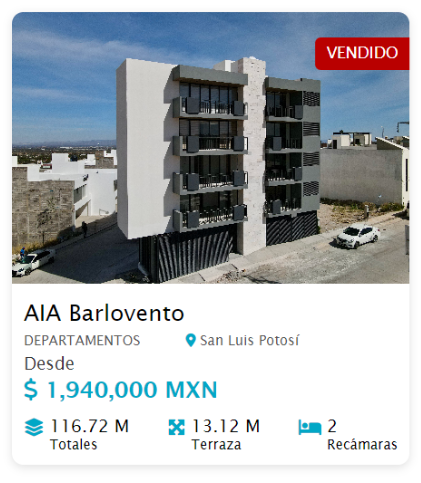

# AIA Partners: Ejercicio técnico

- [Instrucciones](#instrucciones)
- [Repositorio](#repositorio)
- [Requerimientos](#requerimientos)
- [Plus: Requerimientos adicionales](#plus-requerimientos-adicionales)

## Instrucciones

- Lee cuidadosamente los requerimientos del ejercicio.
- Hay instrucciones adicionales al final del documento. No es necesario que las
  desarrolles, pero si lo haces, te darán puntos extra.

## Repositorio

Crea un repositorio en GitHub para realizar este reto. Tú decides si es público
o privado.

- Si es público, envía un correo a
  [francisco.flores@aiapartner.com](mailto:francisco.flores@aiapartner.com) y
  [cesar.sustaita@aiapartner.com](mailto:cesar.sustaita@aiapartner.com)
  compartiendo el enlace a tu repositorio.
- Si es privado, invita al repo a
  [@jacob-partner](https://github.com/jacob-partner) y
  [@cesar-partner](https://github.com/cesar-partner) como **collaborator**.
- ⚠️ Tendrás hasta mañana a las 23:59 horas para compartir tu repo.

## Requerimientos

Replica la maquetación del siguiente diseño (card) utilizando tecnologías web en
base al archivo JSON que se encuentra en el archivo
[**barlovento.json**](./barlovento.json).

- **Estilos:** Para los estilos, utiliza CSS puro. No utilices frameworks de
  diseño (bootstrap, tailwind, Material UI, etc).
- **Maquetación:** Para maquetar y resolver el ejercicio, puedes utilizar HTML,
  JavaScript puro, o algún framework como React, Vue, Angular, etc. No hay
  limitaciones. Utiliza lo que te sea más cómodo.
- **Responsividad:** El diseño debe ser responsivo.
- **Documentación**: En un archivo `README.md`, explica brevemente cómo ejecutar
  tu solución, así como cualquier detalle que consideres importante. También
  indica qué tecnologías utilizaste.

## Plus: Requerimientos adicionales

Para dar un extra a tu trabajo, considera las siguientes instrucciones. **No es
necesario que las desarrolles.**

- Utilizar Vue para desarrollar la solución, dado que en AIA Partners es el
  framework que utilizamos para realizar los proyectos.
- Generar al menos un cambio en el diseño de la card. Modifica el diseño tanto
  como quieras, pero manteniendo la paleta de colores original.
- Genera todas las cards necesarias para mostrar el arreglo de proyectos que se
  encuentra en el archivo [**proyectos.json**](./proyectos.json).
  - Muestra primero los proyectos activos (indicado con la propiedad
    `isAvailable`) y al final los inactivos.
